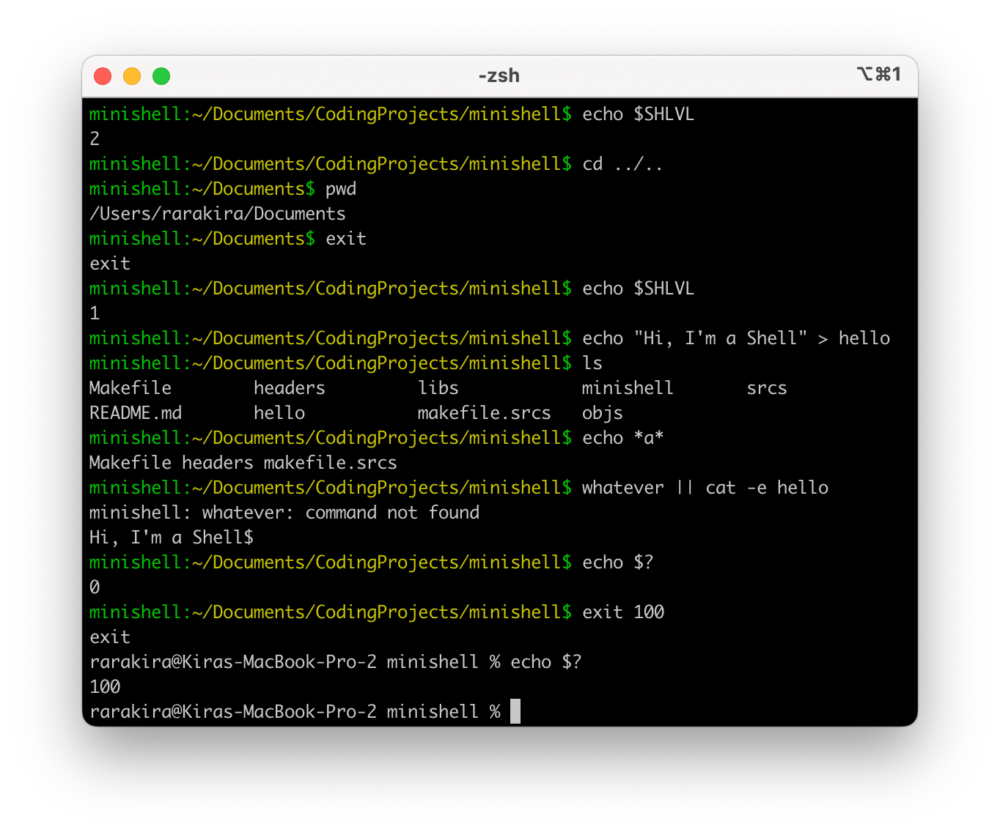

_This is a **21 School/Ecole 42** Project. Worked in team with [Cflorind](https://github.com/splinehip)_

# minishell

Coding a simple CLI shell with basic functionality. Subject can be found [here](https://cdn.intra.42.fr/pdf/pdf/43461/en.subject.pdf).

## Project goals

* Understand the way shells work
* Implement redirections, pipes, handle environment variables
* Practice signal handling
* Implement list of builtins



## Features

### Basics:
- History of previous entered commands
- Search and launch the right executable (based on the `PATH` variable, using a relative or an absolute path)
- Environment variables (`$` followed by a sequence of characters) expand to their values
- Wildcards `*` in the current working directory
- `ctrl-C`, `ctrl-D` and `ctrl-\` behave like in bash
- `’` (single quotes - prevent from interpreting meta-characters in quoted sequence)
- `"` (double quotes - prevent from interpreting meta-characters in quoted sequence except for $)
- `$?` expands to the last exit status
- `|` connect cmds or groups with pipes; output of a cmd is connected to the input of the next cmd via a pipe
- `&&` and `||` with parenthesis for priorities

### Builtins:
- `echo` with option -n
- `cd`
- `pwd` without options
- `export` without options
- `unset` without options
- `env` without options
- `exit [exit_status]` without options

### Redirections:
`[n]` (optional) specifies the file descriptor, if not specified it is stdout/stdin
- `[n]< file` Redirecting Input
- `[n]<< limiter` Here Documents
- `[n]> file` Redirecting Output
- `[n]>> file` Appending Redirected Output

## To compile and run
Run the following commands in Terminal:
```shell
# to build
> make

# to run
> ./minishell 
```
